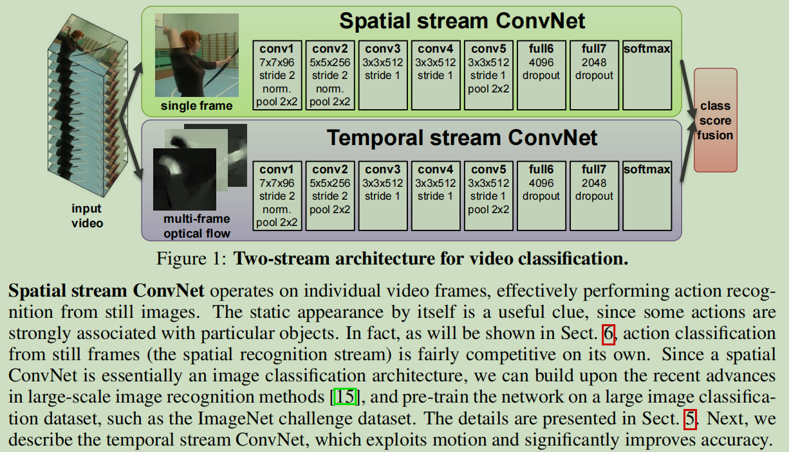
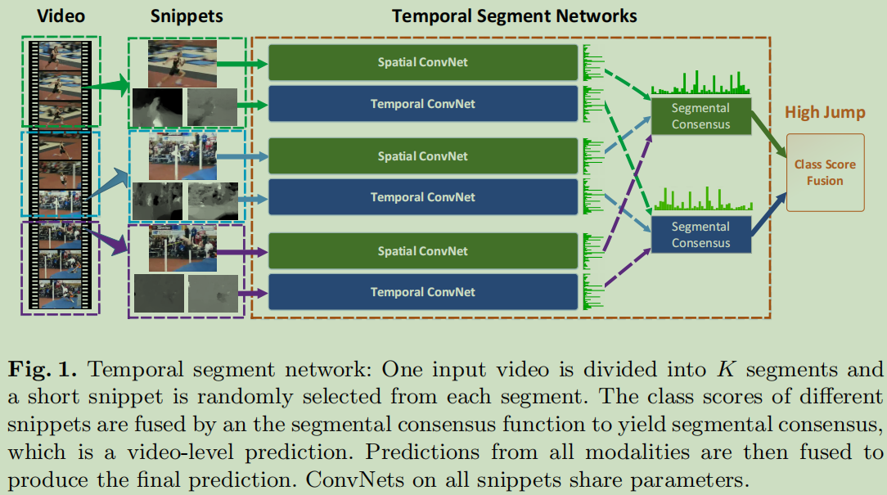
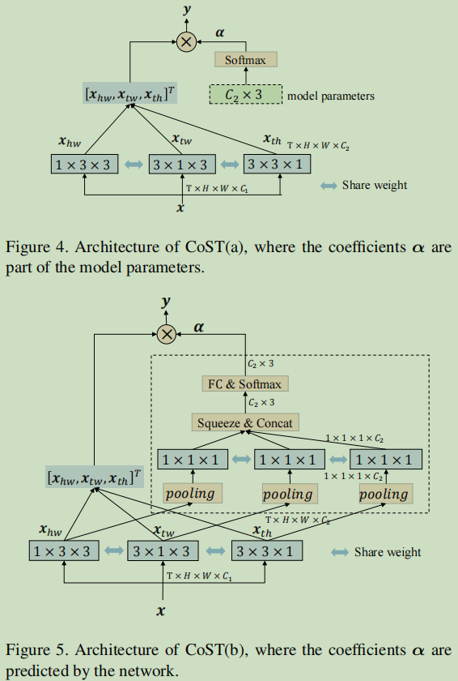
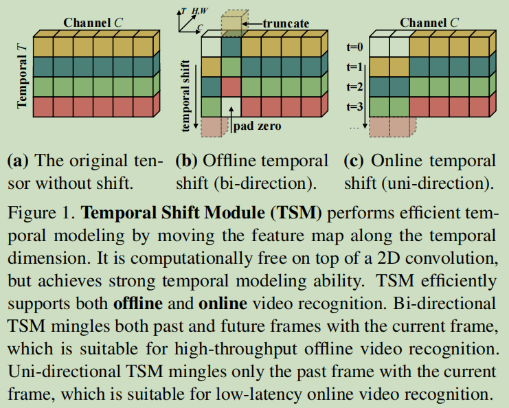
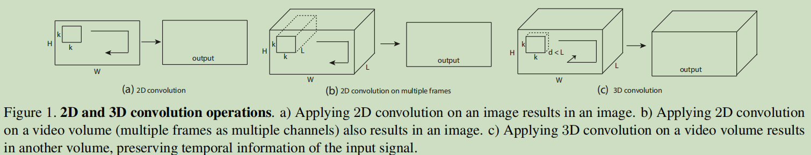
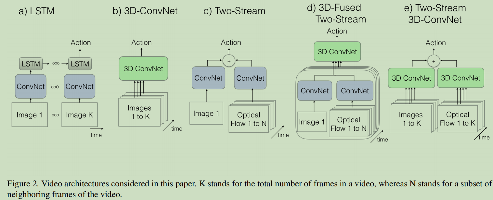
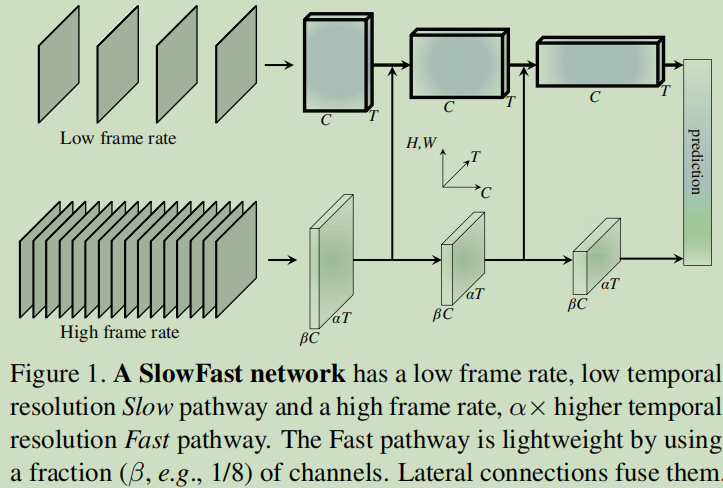

# paper-video-action-recognition

This is the repository of Randle's paper in video action recognition.

In this repository, following the advice of my mentor, I create this repository to record what I read and give a general description about this area. I mainly divide this area into *general video understanding* and *interaction*(human-object detection, compositional action recognition).

```latex
root/
	|--general video understanding/
		|--2d-cnn-based/
			|--2014 Two-Stream Convolutional Networks for Action Recognition in Videos
			|--2016 Temporal Segment Networks: Towards Good Practices for Deep Action Recognition
			|--2019 Collaborative Spatiotemporal Feature Learning for Video Action Recognition
			|--2019 TSM: Temporal Shift Module for Efficient Video Understanding
		|--3d-cnn-based/
			|--2015 (C3D)Learning Spatiotemporal Features With 3D Convolutional Networks
			|--2017 (I3D)Quo Vadis, Action Recognition? A New Model and the Kinetics Dataset
			|--2019 SlowFast Networks for Video Recognition
		|--gnn-based/
			|--2018 Videos as Space-Time Region Graphs
			|--2021 Spatially Conditioned Graphs for Detecting Human–Object Interactions
		|--transformer-based/
			|--2019 Video Action Transformer Network
			|--2021 Is Space-Time Attention All You Need for Video Understanding?
			|--2021 Video Transformer Network
			|--2021 ViViT: A Video Vision Transformer
	|--interaction/
		|--2017 The “something something” video database for learning and evaluating visual common sense
		|--2018 Detecting and Recognizing Human-Object Interactions
		|--2018 Non-local Neural Networks
		|--2018 iCAN: Instance-Centric Attention Network for Human-Object Interaction Detection
		|--2019 Long-Term Feature Banks for Detailed Video Understanding
		|--2019 Transferable Interactiveness Knowledge for Human-Object Interaction Detection
		|--2020 Understanding Human Hands in Contact at Internet Scale
		|--2020 Something-Else: Compositional Action Recognition with Spatial-Temporal Interaction Networks
		|--2021 Hand-Object Interaction Reasoning
		|--2021 Revisiting spatio-temporal layouts for compositional action recognition
		|--2022 Highlighting Object Category Immunity for the Generalization of Human-Object Interaction Detection
		
```

# general video understanding

### 2d-cnn-based

2d-cnn-based model has been less common after the broad application of 3d-cnn-based model. These models are the 

#### 2014 Two-Stream Convolutional Networks for Action Recognition in Videos



An early classic paper that first propose the two-stream structure. It not only utilizes the RGB information but optical flow. The fusion could be SVM or other classifier. However the results are not so remarkable on some datasets.

The result: UCF101($88.0\%$), HMDB51($59.4\%$)

#### 2016 Temporal Segment Networks: Towards Good Practices for Deep Action Recognition



The main idea is to divide a video into $K$ segments, and extract $1$ of each and make fusion of the logits(backbone: Two-Stream). In this model, the TSN model ultilize both spatial and temporal feature of frames. The results are better than Two-Stream network. The main advantage is that it can process longer videos than Two-Stream network.

The result: UCF101(94.2%), HMDB51($69.4\%$)

#### 2019 Collaborative Spatiotemporal Feature Learning for Video Action Recognition



The result:  Moments in Time($32.4\%$), Kinetics($77.5\%$)

#### 2019 TSM: Temporal Shift Module for Efficient Video Understanding



In this paper, TSM(Temporal Shift Module) is a special model based on TSN that extract shifting tensor. The main idea is to shift some part into the past or the future feature map and obtain the results equals to 3d-cnn-based models with 2d-cnn-based cost.

The result: Kinetics($74.1\%$, + $3.5\%$ with TSN), UCF101($95.9\%$, + $4.2\%$ with TSN), HMDB51($73.5\%$, + $8.8\%$ with TSN), Sth-SthV2($61.7\%$,+$31.3\%$ with TSN)

### 3d-cnn-based

3d-cnn-based model is now commonly used as a base model to extract feature, but not individually used to complete the whole task. Compared with 2d-cnn-based models, 3d-cnn-based models generally get better performance in various tasks. It can better extract temporal information with its special kernel. 

#### 2015 (C3D)Learning Spatiotemporal Features With 3D Convolutional Networks



It is the first 3d-cnn-based model that could be applied in action tasks. The main idea is to utilize 3d-kernel to extract high level feature.

The result: UCF101($90.4\%$)

#### 2017 (I3D)Quo Vadis, Action Recognition? A New Model and the Kinetics Dataset



The famous I3D network. On the figure above, the I3D structure is an inflated structure based on Resnet-101. The most ominous part is its great fine-tuned results.

The result: UCF101($93.4\%$, $84.5\%$ with only RGB, $90.6%$ with only optical flow), HMDB51($93.4\%$, $49.8\%$ with only RGB, $61.9\%%$ with only optical flow)

#### 2019 SlowFast Networks for Video Recognition

pyslowfast: https://github.com/facebookresearch/SlowFast



In this paper, a kind of two stream architecture is proposed to extract fast motion change and slow spatial change in the same time. It is different from the Two-Stream model that it 

The result: 

### gnn-based

I initially believed that gnn-based models are the correct answer for video understanding as it resemble to what people's visual mechanism. GNN models used in relationship detection tasks demonstrate great capability to extract interaction information. However, such network has a critical defect that it can't be too deep or it'll lose the position information. However, it could be used in multi-modality in some tasks to process some language information.

#### 2018 Videos as Space-Time Region Graphs


#### 2021 Spatially Conditioned Graphs for Detecting Human–Object Interactions


### transformer-based

#### 2019 Video Action Transformer Network


#### 2021 Is Space-Time Attention All You Need for Video Understanding?


#### 2021 Video Transformer Network


#### 2021 ViViT: A Video Vision Transformer


## interaction

#### 2017 The “something something” video database for learning and evaluating visual common sense

#### 2018 Detecting and Recognizing Human-Object Interactions

#### 2018 Non-local Neural Networks


#### 2018 iCAN: Instance-Centric Attention Network for Human-Object Interaction Detection

​		

#### 2019 Long-Term Feature Banks for Detailed Video Understanding

#### 2019 Transferable Interactiveness Knowledge for Human-Object Interaction Detection

#### 2020 Understanding Human Hands in Contact at Internet Scale

#### 2020 Something-Else: Compositional Action Recognition with Spatial-Temporal Interaction Networks

#### 2021 Hand-Object Interaction Reasoning

#### 2021 Revisiting spatio-temporal layouts for compositional action recognition

#### 2022 Highlighting Object Category Immunity for the Generalization of Human-Object Interaction Detection


